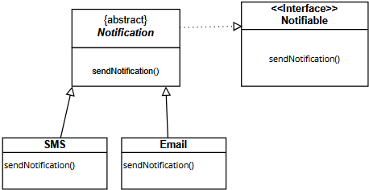
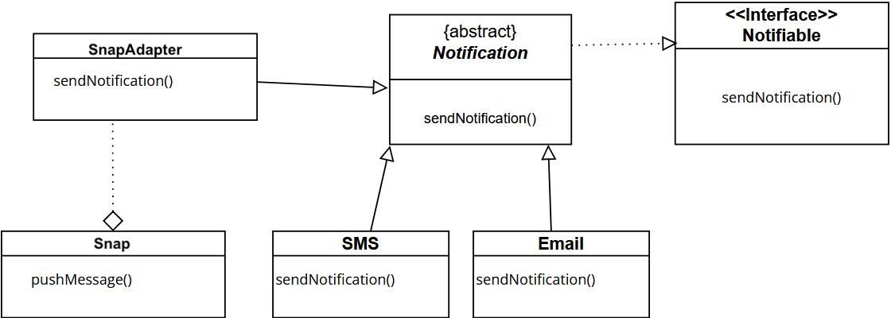

# Énoncé
### Exercice 1

On considère un système de notification qui permet d'envoyer des alertes via différents canaux de communication (SMS, Email, Notification Push). Chaque canal de communication doit implémenter une interface Notifiable qui définit une méthode sendNotification.
\
Voici le diagramme de classe:


Une nouvelle équipe de développement propose une classe PushNotification qui possède une méthode pushMessage au lieu de sendNotification. Cette classe ne peut pas être modifiée directement pour implémenter l'interface Notifiable.
````java
public class PushNotification {
    public void pushMessage(String message) {
        System.out.println("Notification Push envoyée : " + message);
    }
}
````

#####  Question 1 :
Utiliser le pattern Adapter dans sa version « Object Adapter » pour résoudre ce problème. Définissez un diagramme de classe illustrant votre solution.

##### Question 2 :

Coder en Java votre solution de la question 1 en utilisant la classe PushNotification fournie.

L'exécution du programme doit donner lieu à un affichage console similaire à l'affichage suivant :
````
Notification Push envoyée : Alerte importante !
````
___
# Correction
##### Question 1

Pour utiliser la version "Object Adapter", il faut créer une classe PushNotificationAdapter qui hérite de la classe abstraite Notification et qui contient une instance de PushNotification.

Voici le diagramme UML : 



##### Question 2
Voir code